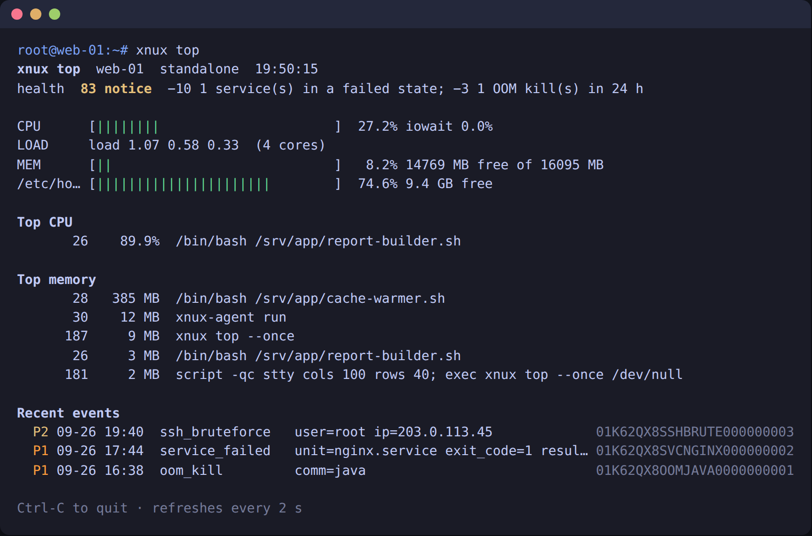

# xnux-agent

English | [简体中文](README.zh-CN.md)

The open-source agent of [Xnux](https://xnux.net): server monitoring that captures the scene when something breaks — crashes, OOM kills, intrusions — and redacts it on the machine before anything leaves.

The agent is open source and its output is verifiable: you can see every byte that leaves your server, and we never get access to your server.

| | |
| --- | --- |
| `cmd/`, `internal/` | `xnux-agent`: Go, statically linked, amd64 / arm64, Linux ≥ 4.15 |
| `relay/` | Cloudflare Worker relays: `xnux-relay` (hides the origin IP) and a Bark push relay |
| `deploy/` | `install.sh` / `uninstall.sh`, systemd unit, sample config |
| `docs/` | Installation, reported fields, redaction rules, least privilege, Worker relay |

The reporting protocol and the redactor live in [xnux-shared](https://github.com/xyfu/xnux-shared), shared by the agent and the server. License: Apache-2.0.

## Black box: works without an account

Installed without a token, the agent is a local black box for one server: it keeps recording metrics (24 hours) and crash, OOM and intrusion context (30 days), so one command tells you what happened. No network connections, no alerts, free.

```sh
curl -fsSL https://github.com/xyfu/xnux-agent/releases/latest/download/install.sh | sudo sh
xnux top        # live dashboard     xnux events / xnux event ID    # incident context
xnux history    # 24-hour charts     xnux status                    # self-check and health score
```



When you want several servers in one place, alert notifications or AI root-cause analysis: `sudo xnux connect --token xat_…` switches to reporting without a restart. See [docs/standalone.md](docs/standalone.md).

## Report to Xnux

Copy the command from "Add server" in the Xnux console, or:

```sh
curl -fsSL https://github.com/xyfu/xnux-agent/releases/latest/download/install.sh | sudo sh -s -- --token xat_…
```

The script installs only after checking sha256 sums; see [docs/install.md](docs/install.md).

## Verify it yourself

| To check | How |
| --- | --- |
| 1. What the agent will send | `curl -fsSL …/install.sh \| sh -s -- --dry-run` (installs and sends nothing, no root needed); once installed, `xnux payload --next` |
| 2. What it just sent | `xnux payload --last` (i.e. `/var/log/xnux/last_outgoing_payload.json`); compare it and its sha256 with the original shown on the console's transparency audit page |
| 3. That the binary is built from this source | `git checkout vX.Y.Z && make agent VERSION=vX.Y.Z COMMIT=$(git rev-parse --short HEAD) && sha256sum bin/xnux-agent-linux-*`, and compare with the release's `SHA256SUMS`; files are also cosign-signed |

The agent makes exactly one kind of outbound request (`POST /v1/ingest`, and not even that in standalone mode). It listens on no network port (the CLI talks to it over a local Unix socket), accepts no remote commands and never updates itself. Fields: [docs/payload.md](docs/payload.md); redaction: [docs/redaction.md](docs/redaction.md); running without root: [docs/least-privilege.md](docs/least-privilege.md); hiding the origin IP: [docs/relay.md](docs/relay.md).

## Development

```sh
make agent            # bin/xnux-agent-linux-{amd64,arm64}
make test             # go test -race + relay tests
make lint             # golangci-lint
make dist             # everything a release publishes, with SHA256SUMS
```

Implementation notes and differences from the spec: [docs/agent.md](docs/agent.md).
