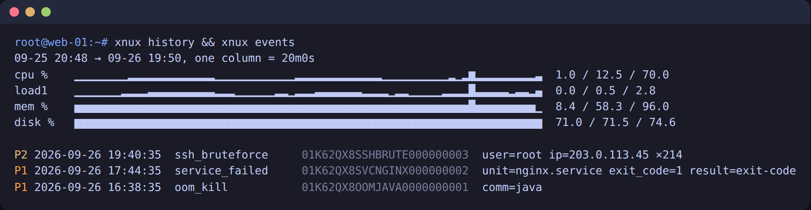

# 黑匣子：不连 Xnux 也能用

探针不带 token 安装时是**独立模式**：它在本机持续记录指标和崩溃、OOM、入侵现场，出事后用 `xnux` 命令查看。不建立任何网络连接，不需要注册，免费。


## 安装

```sh
curl -fsSL https://github.com/xyfu/xnux-agent/releases/latest/download/install.sh | sudo sh
```

和上报模式是同一个二进制、同一个安装脚本，只是不带 `--token`。脚本会：

- 安装 `/usr/local/bin/xnux-agent`，并建软链接 `/usr/local/bin/xnux`（按调用名区分守护进程和命令行）；
- 创建 `xnux` 组，并询问是否把当前 sudo 用户加入（加入后不用 sudo 就能用 `xnux`，下次登录生效）。非交互安装用 `--add-user alice` 或 `--no-prompt`。

## 命令

| 命令 | 作用 |
| --- | --- |
| `xnux top` | 终端实时面板：CPU、负载、内存、Swap、磁盘（含写满倒计时）、温度、Top 5 进程、最近 5 条事件、健康度；每 2 秒刷新，`--once` 只打印一帧 |
| `xnux events [--type T,…] [--since 24h] [--severity P0,…]` | 本机记录的事件（保留 30 天） |
| `xnux event ID` | 一个事件的完整现场：退出码、信号、日志尾部、进程快照、事发前 10 分钟曲线 |
| `xnux history [--metric cpu,mem,load,disk] [--hours 24]` | 最近 24 小时指标的终端折线图 |
| `xnux status` | 采集器、模式（独立 / 上报）、存储占用、健康度扣分明细 |
| `xnux payload [--last\|--next]` | 最近一次上报 / 下一次将要上报的内容 |
| `xnux connect --token xat_… [--endpoint URL]` | 切到上报模式（需 root） |
| `xnux disconnect` | 切回独立模式，删除 token（需 root） |

所有命令都支持 `--json`。终端宽度小于 80 列时 `xnux top` 自动精简布局；`LANG` 含 `zh` 时健康度说明为中文。



## 本地存储

| 路径 | 内容 |
| --- | --- |
| `/var/lib/xnux/events/YYYYMMDD.jsonl` | 事件，追加写，每条写完 fsync；单文件超过 10 MB 轮转（`YYYYMMDD.1.jsonl`…），保留 30 天 |
| `/var/lib/xnux/metrics.ring` | 1440 槽 × 72 字节的环形文件，每分钟一条：平均值；磁盘与温度取该分钟最坏值 |
| `/run/xnux/agent.sock` | 命令行与守护进程的 Unix Socket，0660，属组 `xnux`；行分隔 JSON |

本地存的是**原始**数据（从不离开机器），文件都是 0600。只有切到上报模式后，数据才经过脱敏屏障再发出，见 [redaction.md](redaction.md)。总量上限 350 MB（事件超过 340 MB 时删最旧的文件）。

断电安全：事件每条 fsync，写到一半的末行会在下次写入前补换行、读取时跳过；指标每条记录带 CRC，写坏的那一分钟读取时跳过。最多丢最后一条。

## 与 Xnux 的关系

| 本地（免费、开源） | Xnux SaaS |
| --- | --- |
| 单台服务器 | 多台集中查看 |
| 指标 24 小时（1 分钟精度），事件 30 天 | 长期历史与图表 |
| 手动查看，**不发任何告警** | 告警推送（免费档含 2 台） |
| 原始现场数据 | AI 归因、App 修复、拨测、状态页、团队 |

想要告警时：

```sh
sudo xnux connect --token xat_…     # 控制台「添加服务器」里的 token
```

`connect` 写入配置后通过 Socket 通知守护进程**不重启**地重载：上报通道当场建立，首批数据在几秒内送达，本地记录不中断。`xnux disconnect` 反过来：删除 token，停止上报，继续本地记录。

## 验证它确实不联网

```sh
xnux status                  # mode: standalone
sudo ss -tnp | grep xnux     # 没有任何连接
```

独立模式下上报模块根本不初始化；守护进程只监听那个 Unix Socket，不监听任何网络端口。
